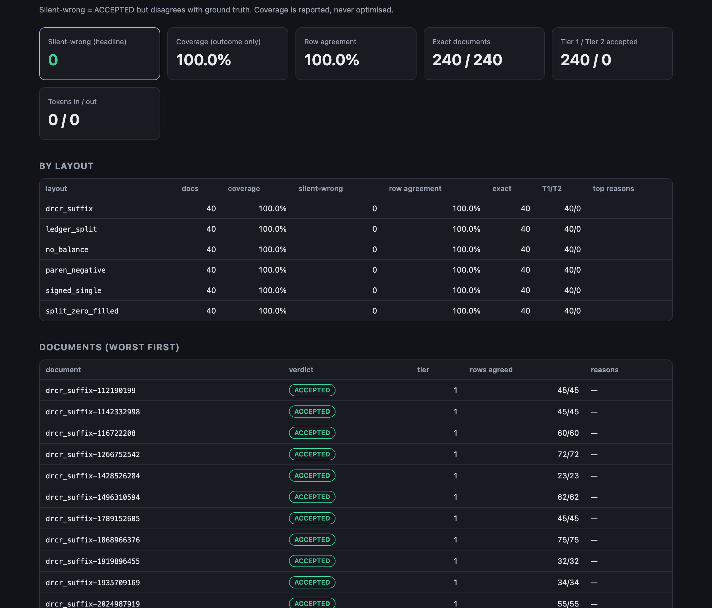

# Statement

**Bank-statement PDFs → verified transactions.** A deterministic parser reads
first, an LLM rescues second, and **only arithmetic decides what is
accepted.** A supervised Claude skill adds support for new layouts by writing
data, scored against ground truth it cannot see or edit.

> A bank statement checks itself. The running balance is a hash chain over
> the transactions:
>
> `balance[i] = balance[i-1] + credit[i] − debit[i]`
>
> Drop a row, flip a sign or misread a digit, and the chain breaks. So
> Statement can use a fallible reader and still refuse every answer the
> arithmetic can't vouch for.

---

## Results



*The holdout scorecard as `statement eval` writes it (`scorecard.html`, dark theme).*

All numbers below are on the **forge corpus**: synthetic statements with
exact ground truth (ADR-0010). Every number has a scorecard with its run
manifest in [`docs/results/2026-10-02/`](docs/results/2026-10-02/).
Machine: Apple M4, Python 3.12.8, one worker.

| Corpus | Docs | Rows | Silent-wrong | Coverage | Row agreement | Notes |
|---|---:|---:|---:|---:|---:|---|
| **holdout** (sealed, secret seed, 6 layouts) | 240 | 10,128 | **0** | 100% | 100% | 2 of the 6 layouts were onboarded by the agent |
| dev (4 original layouts) | 160 | — | **0** | 100% | 100% | written against these layouts; proves self-consistency only (risk R1) |
| drift (same banks, changed template) | 160 | — | **0** | 0% | 0% | Tier 1 fails **loudly**; no LLM configured to rescue |

- **Silent-wrong** means `ACCEPTED` but disagreeing with truth. It is the
  headline metric, and its target is 0.
- **Coverage** is reported as an outcome only. It is never optimised
  (ADR-0013).

**Corruption detection (H1).** 12 catalogue failures were injected into
correct statements, 3 trials × 240 holdout statements:

| | applied | caught |
|---|---:|---:|
| 10 single-row failure classes (dropped / duplicated / merged rows, swapped sign, transposed digits, wrong year, day↔month swap, locale misread, summary line read as a row, zero read as missing) | 7,080 | **7,080 (100%)** |
| F06: description attached to the wrong row | 720 | 0, an **expected escape** |
| F13: two errors that cancel | 720 | 0, an **expected escape** |

The two escapes are not hidden. They are why ground-truth evaluation exists
at all, and the build hit one for real: see [what broke](#what-broke).

**Speed.** About 45 ms per document (≈27 ms per page) for Tier 1, with
pdfplumber dominating.

### Claims and their status

| | Claim | Status |
|---|---|---|
| **H1** | Balance-chain verification catches the extraction errors that matter | ✅ **100%** of 7,080 detectable single-row corruptions; the 2 expected escape classes are reported |
| **H2** | Verify-then-escalate keeps the silent-wrong rate at **0** | ✅ for Tier 1: 0 across 560 documents · ⏳ for Tier 2: plumbing proven with scripted models; **no real model measured yet** |
| **H3** | An LLM rescue raises coverage on unseen or changed layouts | ⏳ **unmeasured.** The drift split (0% → ?) is ready; it needs an API key or a local model |
| **H4** | A supervised agent onboards a layout from ≤10 samples, writing only data | ✅ mechanism: 2 layouts in about 3 minutes each, 40/40 holdout each · ⚠ **not a blind trial** (the agent also wrote the generator) |
| **H5** | Hosted-model drift is real and cheaply detectable | ⏳ the canary is built and tested; it needs a key and ≥4 weeks of history |

---

## How it works

```
 PDF ─► ① ingest ─► ② text layer ─► ③ classify ─► ④ TIER 1 (profile) ─► ⑤ VERIFY ─► ACCEPTED
        size/magic    words+boxes     fingerprint    header-anchored         │
        REJECTED      REJECTED                       columns                 │ fail / unknown layout
                                                                             ▼
                                             ⑥ TIER 2 (LLM rescue) ─► ⑦ VERIFY ─► ACCEPTED
                                             copies cells by line id   same bar
                                             grounding: every number
                                             must be printed
                                                                             │ fail / error / budget
                                                                             ▼
                                                                    ⑧ NEEDS_REVIEW (never trusted)
```

Five rules hold the design together:

1. **Arithmetic decides (INV-05).** No model output, confidence or prompt can
   set a verdict. The LLM package cannot even import the verifier: an
   import-linter contract enforces it in CI.
2. **Grounding (INV-06).** Every number a model returns must appear verbatim
   on the page. A model can misplace a number but cannot invent one.
3. **The model copies; code assembles (INV-07).** Number locale, date format
   and sign convention are inferred from evidence by code. Ambiguity, such as
   DD/MM with every day ≤ 12, is reported, never guessed.
4. **Profiles are data.** A layout is a 30-line YAML file with a strict
   schema. It has no place for literal amounts, so an agent cannot memorise
   answers into it.
5. **Errors are values.** Every non-accepted document carries
   machine-readable reasons. `statement explain` shows the climb up the
   ladder.

---

## Quickstart

```bash
make sync      # local .venv; uv cache kept inside the repo
make corpus    # forge dev / unknown / drift corpora (seeded, ~3 s)
make eval      # score them; HTML scorecards under runs/
make corrupt   # H1 corruption-detection run
make check     # ruff, mypy --strict, import contracts, guards, 135 tests
```

Inspect a single document:

```bash
uv run statement explain corpus/dev/drcr_suffix-0000003.pdf
```

```
drcr_suffix-0000003.pdf  doc_id 7bc7646aa7bb
  ingest      ok                 0.00 ms
  text_layer  ok                24.01 ms
              · 1 pages
              · 30 lines
  classify    drcr_suffix        0.05 ms
              · v1
  tier1       statement          1.30 ms
  verify      pass               0.02 ms
              · totals=pass
              · dates=pass
              · balance_presence=pass
              · chain=pass
  => ACCEPTED (tier 1, 21 rows)
```

To turn on Tier 2 (off by default, so nothing leaves the machine):

```bash
export STATEMENT_LLM=anthropic STATEMENT_ANTHROPIC_API_KEY=...
uv run statement eval corpus/drift --cache record   # live calls, answers cached
uv run statement eval corpus/drift                  # replay: free and deterministic
```

or a local model with `STATEMENT_LLM=ollama`.

## Onboarding a layout with the agent

```
/add-layout split_zero_filled corpus/onboard/split_zero_filled
```

The skill is [`.claude/commands/add-layout.md`](.claude/commands/add-layout.md).
It has five stages and three human gates:

```
intake ─► baseline ◆ ─► draft ─► iterate ◆ ─► regress ─► report ◆
```

It may write only `profiles/`, `tests/profiles/` and `docs/onboarding/`.
CI's path guard enforces this. The holdout is generated in CI from a
secret the agent never sees.

The first real run shows why the goal and anti-goal are in bold at the top
of the skill. Profile v1 reached **100% coverage with 2 silently wrong
documents**: a bank notice line was glued onto descriptions, and the
arithmetic couldn't see it. A coverage-maximising agent would have shipped
it. Row agreement against truth caught it, and v2 fixed it. The full log is
in [`docs/onboarding/split_zero_filled.md`](docs/onboarding/split_zero_filled.md).

## What broke

The build's [session log](docs/sessions/2026-10-02-build.md) records 11
real failures. The best one: on day one, a forge bug made long descriptions
overflow into the next column. pdfplumber interleaved the characters, and
**13 documents were ACCEPTED with garbled descriptions**, because the
arithmetic was untouched. That is exactly the escape class the design
predicts (§B5). The forge now refuses to draw overlapping text, and the
scorer is the reason anyone noticed.

## Layout

```
src/statement/
  domain/      money · model · parsing · assemble · verify · profile   (pure)
  extract/     tier 1
  rescue/      tier 2: prompt · schema · grounding · rule inference
  pipeline/    the trust ladder and the verdict
  evaluate/    scorer · corruption harness · reports · canary
  forge/       ledger simulator · 6+4 layouts · corpus splits
  adapters/    pdfplumber · reportlab · Anthropic/Ollama over httpx · cache · profiles
  cli/         typer CLI · composition root
profiles/      one YAML per layout
canary/golden/ 30 fixed synthetic PDFs for the drift canary
scripts/       CI guards · onboarding intake
```

## Documentation

| | |
|---|---|
| [BUILD-PLAN.md](docs/BUILD-PLAN.md) | the specification: hypotheses, invariants, failure catalogue, increments |
| [ARCHITECTURE.md](docs/ARCHITECTURE.md) | as built, including **every deviation from the plan, with reasons** |
| [adr/](docs/adr/) | 14 decisions, each with what it costs |
| [sessions/](docs/sessions/) | what broke during the build and how it was found |
| [onboarding/](docs/onboarding/) | the agent's iteration logs |
| [results/](docs/results/) | scorecards with manifests behind every number above |

## Limitations

- **Synthetic data only.** The layouts imitate real structural families
  under fictional names (ADR-0011). The numbers do not transfer to real
  statements until checked on a private real set.
- **Text-layer PDFs only.** Scanned statements are `REJECTED` (`NO_TEXT_LAYER`).
- **No real LLM has been run.** Tier 2 is verified with scripted test
  doubles. H3 and H5 are open.
- **CI runs on every push and is green.** The holdout and regression jobs
  run on pull requests; the holdout needs a `STATEMENT_HOLDOUT_SECRET` repo secret.
- **The onboarding trials are not blind.** See the onboarding reports.

## Status

v0.1. Increments M0–M7 of the plan are built and measured. M8 (operate) is
built but not live: the canary needs an API key and four weeks of history.
The repository is public; M9 (a stranger reproduces the numbers) is open. MIT licensed.
